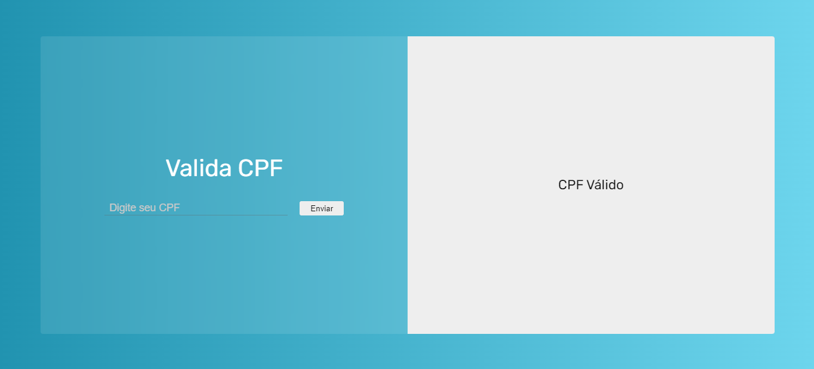

 
  

  &#xa0;

  <!-- <a href="https://validacpf.netlify.app">Demo</a> -->

<h1 align="center">Valida CPF</h1>

  

  <!--  -->

  <!--  -->

  <!--  -->

<!-- Status -->

<!-- <h4 align="center"> 
	🚧  ValidaCpf 🚀 Under construction...  🚧
</h4> 

 -->

  <a href="#dart-about">About</a> &#xa0; | &#xa0; 
  <a href="#rocket-technologies">Technologies</a> &#xa0; | &#xa0;
  <a href="#memo-license">License</a> &#xa0; | &#xa0;
  <a href="https://github.com/{{YOUR_GITHUB_USERNAME}}" target="_blank">Author</a>

 

## :dart: About ##

Este projeto foi desenvolvido baseado em um desafio do curso do professor <a href="https://github.com/luizomf" target="_blank">Luiz Otávio</a>.

Este projeto tem como objetivo validar se um número de CPF é válido.

## :rocket: Technologies ##

Tecnologias utilizadas no projeto:

- [HTML](https://developer.mozilla.org/en-US/docs/Web/HTML)
- [CSS](https://www.w3.org/Style/CSS/Overview.en.html)
- [JavaScript](https://www.javascript.com/)

## :memo: License ##

This project is under license from MIT. For more details, see the [LICENSE](LICENSE.md) file.

Made with :heart: by <a href="https://github.com/marinhoo" target="_blank">Matheus Marinho</a>

Link do projeto: ...

&#xa0;

<a href="#top">Back to top</a>
